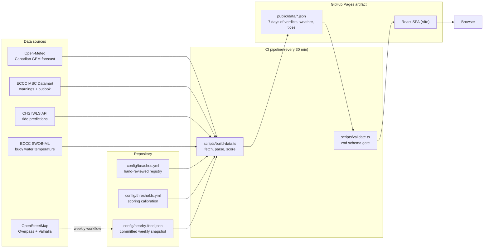
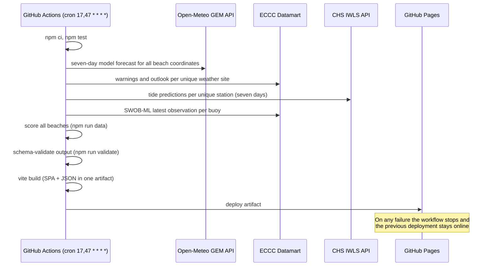

# Architecture

## Overview

whenshouldigotothebeach.ca answers one question: is it a good time to go to a
Nova Scotia beach? It covers 76 saltwater beaches across the province's seven
tourism regions. A visitor can choose any of the next seven local calendar
days. Every beach gets a verdict, a best window, a forecast strip, tide
context, and an explicit confidence level, all computed ahead of time.

The system has no backend. A scheduled GitHub Action fetches public
government and community data, scores every beach, and publishes the result
as static JSON alongside a React single-page app on GitHub Pages. The browser
only ever downloads pre-computed files; it never talks to a weather or tide
API directly.

Out of scope: surf forecasting, water quality sampling, live webcams, and
user accounts. The site reads public data and renders judgment; it does not
collect anything beyond privacy-preserving page analytics.

## Key design decisions

1. **Static pipeline instead of a server.** All fetching, parsing, and
   scoring happens in CI every 30 minutes. The deployed site is a Pages
   artifact: no runtime dependencies, no keys, nothing to operate. The cost
   is freshness, which is bounded and displayed (see staleness below).

2. **A hand-reviewed registry is the source of truth.**
   [config/beaches.yml](../config/beaches.yml) holds coordinates, the ECCC
   weather site and CHS tide station for each beach, shore bearing, exposure,
   and documented tide behaviour. Station assignments are made by coastline
   judgment, never nearest-by-distance: the closest tide station is sometimes
   across a bay with different tidal behaviour. Tests enforce the shape and
   plausibility of every entry.

3. **Honest provenance.** Predicted, observed, and estimated values are never
   presented as the same thing. Every measurement shows its source, distance
   from the beach, and age. A beach without a defensible nearby water
   temperature buoy shows no reading rather than a misleading one.

4. **Safety overrides comfort.** Closures, advisories, and weather warnings
   beat any comfort score, and missing data never produces a favourable
   verdict. Verdicts are: `GO_NOW`, `GOOD_LATER`, `MIXED`, `NOT_GREAT`,
   `WATER_ADVISORY`, `CLOSED`, `HAZARDOUS`.

5. **Failure keeps the last good deployment.** Generated JSON is never
   committed. If a fetch, test, or validation step fails, the workflow stops
   and the previous deployment stays online. Each dataset carries a
   `validUntil` timestamp (150 minutes after generation); once it passes, the
   frontend flags the data as stale instead of presenting it as current.

## System diagram

## Components

### Registry and calibration (`config/`)

- [beaches.yml](../config/beaches.yml): one entry per beach with location,
  region, classification (surface, exposure, shore bearing, tide effect),
  assigned ECCC site, assigned CHS station, optional water buoy, amenities,
  and an official source URL. Changing coverage means editing this file and
  passing the registry tests.
- [thresholds.yml](../config/thresholds.yml): every scoring number lives
  here, not in code. Weights: precipitation 30, wind 20, temperature 15,
  fog 15, sky 12, tide 8.
- [manual-overrides.yml](../config/manual-overrides.yml): time-bounded
  closures or advisories, applied on top of scoring. Timestamps must carry an
  explicit UTC offset.
- [nearby-food.json](../config/nearby-food.json): committed snapshot of
  nearby food places per beach, refreshed by a weekly workflow rather than at
  data-refresh time (see CI below).

### Pipeline (`scripts/`)

- [build-data.ts](../scripts/build-data.ts): the orchestrator. Fetches one
  batched seven-day GEM forecast for all beach coordinates, each unique ECCC
  warning site once, each unique tide station once, and each buoy once. It
  merges in the food snapshot, scores every beach per local calendar day, and
  writes `public/data/day/<date>.json`, `public/data/beach/<id>.json`,
  `public/data/beaches.json` (today's fallback index), and
  `public/data/manifest.json`.
- [lib/open-meteo.ts](../scripts/lib/open-meteo.ts): fetches and normalizes the
  Canadian GEM seamless model. The request is batched across all beach
  coordinates and returned in America/Halifax time.
- [lib/forecast-days.ts](../scripts/lib/forecast-days.ts): owns local-day
  grouping, forecast precision, and confidence. Days zero through two retain
  hourly values; days three through six use three-hour samples. Days four
  through six are marked low confidence.
- [lib/eccc.ts](../scripts/lib/eccc.ts): parses ECCC citypage XML from the
  MSC Datamart's dated directory trees for official warnings and the outlook.
  Two quirks it defends against: the
  `/today/` alias flips at 00:00 UTC mid-run (so it is never used), and the
  Datamart intermittently stamps `forecastIssue` with a future date (rolled
  back against `xmlCreation`).
- [lib/chs.ts](../scripts/lib/chs.ts): fetches `wlp-hilo` (high/low events)
  and `wlp` (curve points) predictions from the CHS IWLS API.
- [lib/water.ts](../scripts/lib/water.ts): parses SWOB-ML buoy observations
  for sea-surface temperature. Display-only; it never enters the score.
- [lib/score.ts](../scripts/lib/score.ts): the pure scoring engine. No I/O,
  fully covered by invariant tests. Thunderstorm risk gates hours outright;
  steady rain and fog cap the score so a warm rainy day cannot rank "good".
- [lib/reasons.ts](../scripts/lib/reasons.ts): turns scored hours into at
  most three structured reasons (`{kind, text, short}`), negatives first.
  The frontend renders these as text and as icon chips.
- [lib/nearby.ts](../scripts/lib/nearby.ts): Overpass query for food places
  plus Valhalla road routing with ferries excluded. Straight-line distance
  misleads across rivers and bays, so displayed distances are road
  kilometres.
- [lib/registry.ts](../scripts/lib/registry.ts) and
  [lib/schema.ts](../scripts/lib/schema.ts): zod schemas for the registry
  and for every generated file. `scripts/validate.ts` re-reads the generated
  output and fails the workflow on any shape violation.

### Frontend (`src/`)

A Vite + React SPA styled with Tailwind on the Nocturne design system (dark
ground, one blurple accent whose brightness encodes score). It fetches the
generated JSON and places a seven-day selector directly below the region
selector on the home page and below the beach name on detail pages. The
selected date lives in the `?date=YYYY-MM-DD` query parameter, so rankings,
map links, detail navigation, refreshes, and shared URLs retain the choice.
The app renders the ranked list, region grouping, search,
favourites (localStorage), an optional Leaflet map with Carto dark tiles,
and per-beach detail pages. Geolocation for "Near me" runs entirely
client-side on explicit tap and never leaves the browser. All times render
in America/Halifax regardless of viewer timezone. Past `validUntil`, every
page shows a DATA STALE banner.

The tree follows the layering from
[bulletproof-react](https://github.com/alan2207/bulletproof-react/blob/master/docs/project-structure.md):
imports flow one way only, shared -> features -> app.

- `app/` owns composition: `app.jsx`, the route table in `router.jsx`, and
  the route components under `app/routes/`.
- `features/beaches/` holds everything specific to the beach domain, split
  into `api/` (one file per request, each pairing the fetcher with the hook
  that consumes it), `components/`, `hooks/`, and `utils/`.
- `components/`, `hooks/`, `lib/`, `utils/` are domain-agnostic and must not
  reach into a feature or the app layer.

`eslint.config.js` enforces those directions with `no-restricted-imports`,
which works because parent-relative imports are banned outright: every
cross-folder import goes through the `@/` alias. Filenames and folders are
kebab-case, checked by `check-file`. There are no barrel files; modules are
imported directly so Vite can tree-shake.

## Data flow: one refresh cycle

The browser loads `manifest.json` (freshness and available dates), then
`day/<date>.json` for the selected day's ranked list and map, and
`beach/<id>.json` on detail pages. `beaches.json` remains today's fallback
index.

## CI workflows

Two workflows feed the site, both in
[.github/workflows](../.github/workflows):

- **Refresh Data and Deploy** (`refresh-and-deploy.yml`), every 30 minutes
  at :17 and :47 (offset from the top of the hour because GitHub delays
  on-the-hour crons). Sequence: `npm ci`, `npm test`, `npm run data`,
  `npm run validate`, `npm run build`, deploy to Pages. Pushing to `main`
  triggers the same workflow, which is how releases ship.
- **Refresh Food Snapshot** (`refresh-food.yml`), Mondays 09:23 UTC. Runs
  `npm run refresh:food` (one province-wide Overpass query, then one
  Valhalla route per beach-place candidate), and commits the updated
  `config/nearby-food.json`. Splitting this out keeps the 30-minute cycle
  fast and keeps the site immune to Overpass rate limits and outages: a
  failed weekly refresh means week-old restaurant listings, not a failed
  deploy.

## External services

Services queried by the CI pipeline (no keys, all public endpoints):

| Service | Endpoint | Data | Frequency |
|---|---|---|---|
| Open-Meteo GEM | `https://api.open-meteo.com/v1/gem` | Canadian GEM seamless weather forecast per beach coordinate | Every 30 min |
| ECCC MSC Datamart | `https://dd.weather.gc.ca/<date>/WXO-DD/citypage_weather/...` | Official outlook, watches and warnings per weather site | Every 30 min |
| CHS IWLS (DFO) | `https://api-iwls.dfo-mpo.gc.ca/api/v1` | Tide predictions: high/low events (`wlp-hilo`) and curve points (`wlp`) per station | Every 30 min |
| ECCC SWOB-ML marine | `https://dd.weather.gc.ca/observations/swob-ml/marine/` | Buoy sea-surface temperature (`avg_sea_sfc_temp_pst10mts`) | Every 30 min |
| Overpass (OSM) | `https://overpass-api.de/api/interpreter` (fallback `overpass.kumi.systems`) | Named restaurants, cafes, bakeries, stores near beaches | Weekly |
| Valhalla (FOSSGIS) | `https://valhalla1.openstreetmap.de/route` | Road distance beach to food place, ferries excluded | Weekly |

Services loaded by the browser at runtime:

| Service | Endpoint | Purpose |
|---|---|---|
| Carto basemaps | `https://{s}.basemaps.cartocdn.com/dark_all/...` | Dark map tiles for the Leaflet map view |
| Google Fonts | `fonts.googleapis.com` / `fonts.gstatic.com` | Inter typeface |
| unpkg CDN | `https://unpkg.com/@phosphor-icons/web` | Phosphor icon web font |
| Plausible (self-hosted) | `https://analytics.novanexus.ca` | Cookie-free page analytics |

The Directions button links out to Google Maps but the site never queries a
Google API.

## Key tradeoffs

- **Freshness is bounded by the cron.** Conditions can change inside the
  30-minute window. Accepted: the alternative is a server, and ECCC re-issues
  hourly forecasts only about four times a day anyway, so most cycles carry
  no new forecast (confidence scoring accounts for issue age).
- **Everything rebuilds every cycle.** Tests, data, and the SPA build run on
  each refresh even when only data changed. Accepted: the build is fast, and
  a single artifact guarantees the frontend and data schema always match.
- **The registry is manual.** Adding a beach means research and review, not
  a form. Accepted deliberately: automated station assignment produced
  plausible but wrong pairings (across-the-bay stations), and wrong tide data
  on Fundy shores is a safety problem, not a cosmetic one.
- **Food data is a weekly snapshot.** Restaurant openings show up days late.
  Accepted: POI churn is slow and the decoupling protects the deploy cycle.
